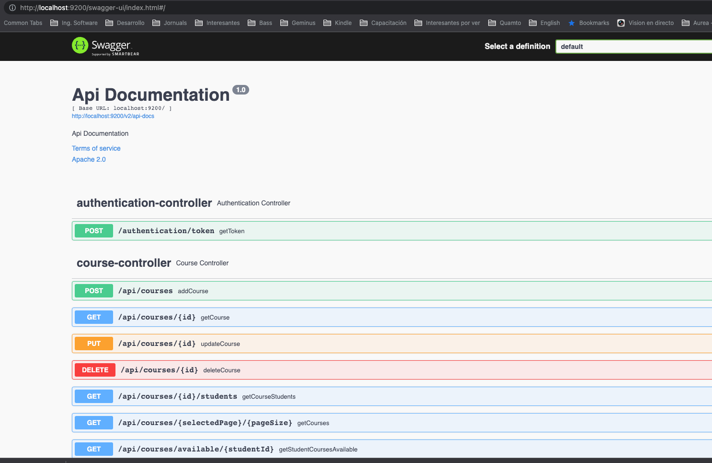

# School Application

### Micro-services

API: Spring-boot application that serves all application backend
UI (Angular/nginx): Nginx server that serves the UI compiled 

###### Security Layers:

* UI requires basic authentication user/password authentication to access to the UI
* API requires Authorization JWT token for all requests (except to retrieve the token), those requests are secured
role-based and some of them are only allowed for admin users.
 
Documentation fo Api Endpoints use swagger UI:
http://localhost:9200/swagger-ui/index.html 

 
### Running complete stack (easy and fast)

###### Requirements

* Docker (Supporting docker-compose command)
* Maven 3+

You can run the complete stack of the application using docker-compose command without DB configuration and
using current docker compose configuration provided in the root path, to run the stack simply run the provided script:

`
./run-stack.sh
`

This will create a service stack with postgres database, UI and API running, to access to those services
use the next URLs:

* API: http://localhost:9200/api
* UI: http://localhost:8080

By default, the application for test purposes has enabled the user admin with the credentials, this user
contains admin privileges:

* username: admin
* password: admin

### Running service by service without stack (service by service)

###### Requirements

* PostgresDB
* Maven +3
* Angular Client
* Node
* Npm or Yarn

###### Running API

To run locally the API you can use the maven command to run the application but you need to set some environment
variables please go to the api/ folder and check the `run-dev.sh` script and change the variables with your data

Running the API from folder api/:

`./run-dev.sh`

To run locally the UI you should use the ng commands to run in developer mode the application, to run it
run:

Located in the ui/ folder run commands:

###### Installing dependencies

`
npm install
`

or using Yarn

`
npm yarn
`

###### Running the server 

`
npm start
`
